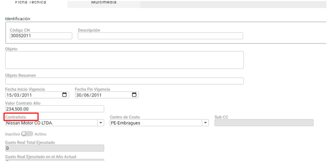
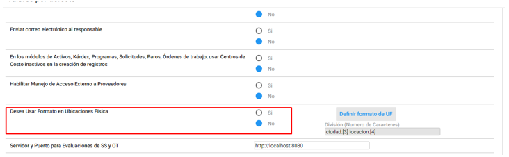
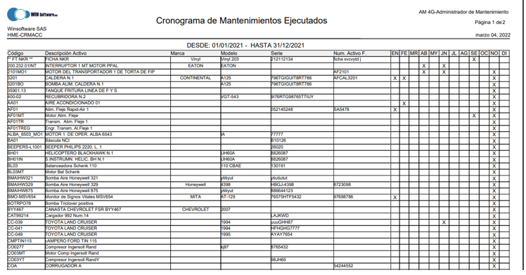
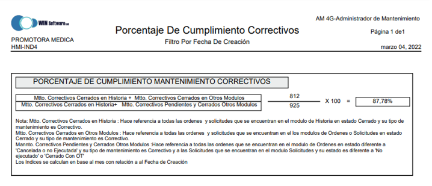

**MODULO DE INFRAESTRUCTURA:**  

**CONTRATOS**

1. Se cambia el label de Responsable a Contratista 

2. Se muestra el nombre del tercero y el código para elegir al contratista.

**UBICACIONES FÍSICAS**

1. Se permite parametrizar a las compañías en la tabla valores por defecto; Si esta compañía utilizara o no prefijo para sus ubicaciones físicas.

Si se desea trabajar con Prefijo, deberá configurarlo y el sistema registrará y mostrará la descripción de la UF según la configuración realizada.

De lo contrario el sistema permitirá escribir y visualizar la descripción de la UF en texto plano.

**MODULO DE ACTIVOS:** 

1. Se desarrolla un indicador para los activos en Estado Inactivo. Mostrara una pelota Roja en el campo de indicadores

2. Se agrega a los filtros la búsqueda por FF dado de Baja

**MODULO DE ORDENES:**

1. Se desarrolla una consulta en Materiales y repuestos la cual mostrara al usuario el saldo actual del repuesto en el almacén, al momento de seleccionarlo.

**MODULO DE HISTORIA:**

1. Se desarrolla un proceso nuevo para mejorar el rendimiento y los tiempos de respuesta en la exportación de datos y la cantidad de registros que permite el sistema descargar.

2. Se agrega a los filtros la búsqueda por FF consumo en otros Conceptos

3. Se agrega un Total a las columnas Tiempo de Espera, Tiempo Total de Solución, Tiempo Improductivo Real y Tiempo de Duración Real en el reporte HMD-TIEMP.

4. Se desarrolla el reporte HME-CRMACC Cronograma de Mantenimientos Ejecutados.
 Este reporte mostrara en que mes se realizaron mantenimientos preventivos sobre los activos.

5. Se realizan ajustes al reporte HMI-IND3 Porcentaje De Cumplimiento Preventivos
 tendrá en cuenta los registros que se encuentran Cerradas en el módulo de Ordenes y no han sido enviados al módulo de Historia.

6. Se realizan ajustes al reporte HMI-IND4 Porcentaje De Cumplimiento Correctivos
 tendrá en cuenta los registros que se encuentran Cerradas en el módulo de Órdenes o Solicitudes y aún no han sido enviados al módulo de Historia.

7. Se estandarizan las prioridades del reporte HMI-IND6 Indicador De Porcentaje Ordenes Atendidas ,como se muestra en la nota al final del reporte.

