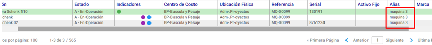
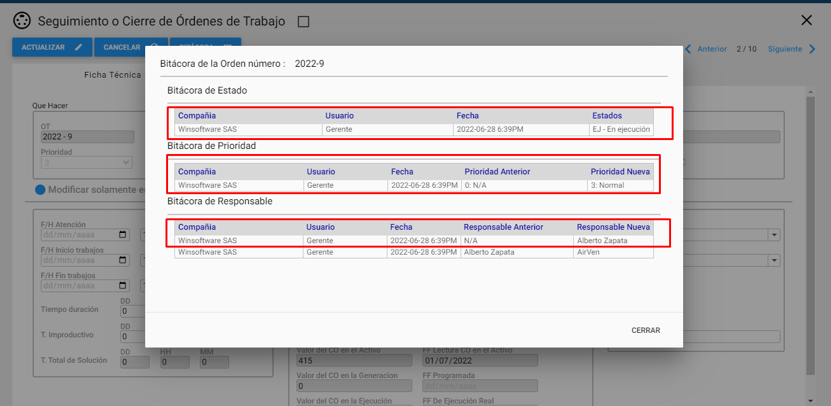
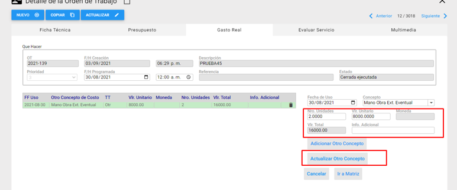

**MODULO DE AMSI:**

- Se desarrolla la función para exportar los datos de la Grilla en AMsi.

**MODULO DE INFRAESTRUCTURA:**
**CONTRATOS**

-  Se ajustan los valores decimales en el cálculo de los contratos

**MODULO DE ACTIVOS:**

- Se desarrolla la validación de valores en los contadores, según su tipo sean incremental o decremental y el estándar de planeación en relación al tiempo de actualización.

- Se agregan los campos Alias y Código de barra Interno a la función de modificación masiva.

**MODULO DE PROGRAMAS:**

- Se corrige el campo Adicionar Comentario en modificación masiva, ahora el sistema permite agregar comentarios a los programas sin borrar la información previa que contenía el programa en este campo.

- Se adiciona el campo Responsable por Institución en la función de modificación masiva.

- Se corrige el campo de insertar Ingresar Presupuesto – Ingresar Materiales y Repuestos en modificación masiva. El usuario debe seleccionar el Almacén desde donde tomara el repuesto antes de abrir la función de búsqueda.

- Se corrige el campo de búsqueda RP-Código el usuario debe elegir primero el almacén antes de desplegar la ventana de búsqueda.

**MODULO DE SOLICITUDES:**

- Se adiciona el campo Fecha FDA (Paro) en la creación de las solicitudes, la fecha de paro precarga por defecto la fecha actual, pero permitirá a los usuarios modificarla por una anterior.

- Se agrega la columna Fecha de Cierre en la función de Exportar Grilla

**MODULO DE ORDENES:**

- Se adiciona modal que contiene la explicación correspondiente a los Colores en la columna de Estado

- Se habilita el campo Agregar Responsable de Gasto Real a la modificación masiva.

- La bitácora de Ordenes de trabajo tomara el registro desde la Creación de la Orden y no desde la primera modificación cómo funcionaba actualmente.

- Se adiciona el campo de Tiempo Total de Solución, este campo será calculado por el sistema y no permite corrección manual, equivale a la diferencia entre la Fecha de Paro y la fecha de Fin de Trabajos.

- Se corrige la función de Actualización en Gasto Real Otros Conceptos.

**MODULO DE HISTORIA:**

- Se lleva al modulo de Seguimiento y Cierre el registro de Activo Limpio.

- Se desarrolla el reporte HMR-RCACD- Resumen De Costos En Ordenes De Trabajo - Agrupado Por Activo Raíz el cual contiene una lista de las Ordenes de trabajo y sus costos agrupados por su Activo Padre.

- Se desarrolla el reporte HMR-RCACDXA - Resumen De Costos En Ordenes De Trabajo - Agrupado Por Activo Raíz y Activos. El cual contiene una lista de Activos con los costos relacionados agrupado por Activo Raíz.

