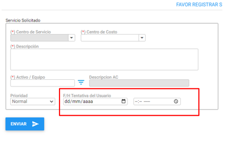
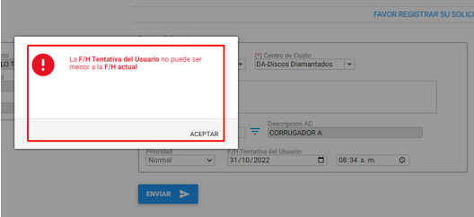
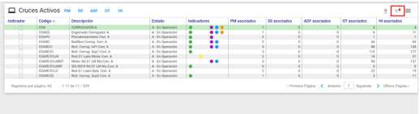
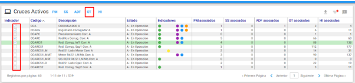
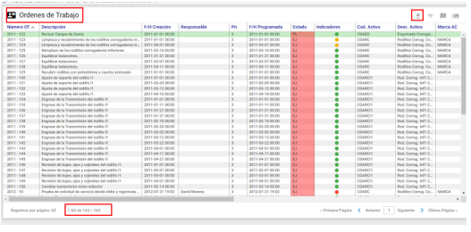
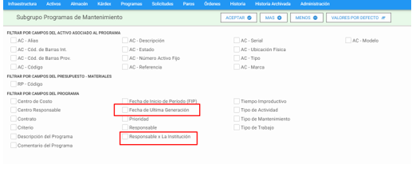
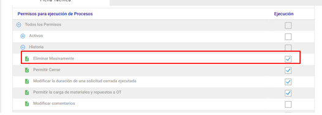
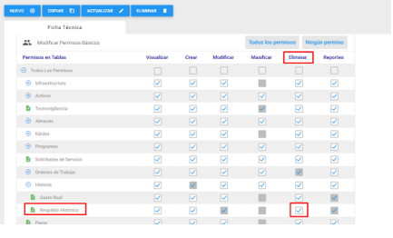
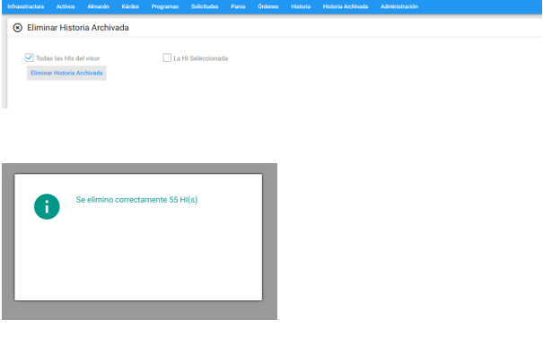

**CAMBIO GLOBAL**

- En los listados desplegables se cambia el seleccionador por un filtro. De esta manera los usuarios al escribir sobre el campo verán solo las opciones que contiene la cadena de caracteres que van escribiendo, permitiendo una búsqueda mas optima y sencilla para el usuario. 

**MODULO DE AMSI:**

- Se desarrolla la parametrización para solicitar la Fecha Tentativa. El usuario administrador del AMsi puede definir si a los usuarios solicitantes se le permite ingresar fecha tentativa o no.

Para esto el usuario administrador debe logearse y en configuración seleccionar la opción que desee.

Si la Opción marcada es No. El usuario solicitante no puede ingresar FF Tentativa.

Si la Opción marcada es Si. El usuario solicitante puede ingresar FF Tentativa.

- Se desarrolla una validación para que la Fecha Tentativa ingresada por el usuario no sea Inferior a la fecha de la solicitud. 

**MODULO DE ACTIVOS:**

- Se desarrolla el submódulo **Cruce De Activos**

En esta grilla los usuarios pueden observar el número de Programas, Solicitudes, Paros, Ordenes y registros e Historia que tiene cada activo. El usuario puede realizar búsquedas por filtros, exportar los datos a un archivo de Excel o realizar búsquedas cruzadas entre uno o varios activos dando como resultado un resume de los registros de cada búsqueda.

Para realizar búsqueda tiene la Opción de filtro ya conocida por los usuarios con los mismos campos de búsqueda del módulo principal de Activos.

Para exportara Excel tiene la Opción a la izquierda del filtro

Obtendrá un archivo plano de acuerdo a la opción solicitada.

Para ver el listado de los registros, el usuario debe seleccionar el o los activos que desea relacionar y dar click sobre el módulo que desea listar.

El sistema desplegara un listado que contiene los registros solicitados según la selección del usuario, estos datos también pueden ser descargados a un archivo plano de Excel.

- Se desarrolla el reporte ACR-INV Resumen De Activos con su Último Mantenimiento Realizado. Con este reporte el usuario puede ver el ultimo mantenimiento realizado al Activo, el módulo en que se encuentra y el comentario del mismo. 

**MODULO DE PROGRAMAS:**

- Se adicionan los filtros de búsqueda por FF de Ultima Generación y Responsable por la Institución 

**MODULO DE SOLICITUDES**

- Las Solicitudes Cerradas Ejecutadas y Cerradas No Ejecutadas luego de encontrarse en este Estado no permitirán el cambio de estado o FF De Atención. 

Si el usuario tiene marcado el Permiso Impedir modificar SS con estado Cerradas. El usuario no podrá realizar ningún cambio sobre las solicitudes Cerradas Ejecutadas y Cerradas No Ejecutadas

**MODULO DE ORDENES:**

- Por defecto los usuarios no podrán realizar ningún cambio sobre una Orden Cerrada Ejecutada o Cancelada. 

Si el usuario tiene marcado el **Permiso Permitir modificar Ordenes en Estado Cerrada Ejecutada.**

El usuario podrá realizar cambios sobre las Ordenes Cerradas Ejecutadas y canceladas. Con excepción de los campos de Estado y la FF de Atención.

- Se preselecciona siempre la opción Ejecución en tiempo Real al relacionar un responsable al Oficio en la matriz de Gasto Real

- Se cambia el total de la Matriz de Presupuesto – Real a Real – Presupuesto, de esta manera se vera en rojo cuando el valor real supere el presupuesto y la diferencia en negro indica que todavía hay presupuesto disponible. 

**MODULO DE HISTORIA:**

- Se desarrolla la función de Eliminar Masivamente en Historia.  

El usuario debe tener el permiso de proceso Eliminar Masivamente de Historia para poder realizar el proceso

Si tiene el permiso el usuario debe ingresar al submódulo Eliminar Masivamente posterior a ver realizado el filtro de los registros que desea eliminar

- Se Adiciona el campo F/H Creación a las Opciones de Exportar. 

**MODULO DE HISTORIA ARCHIVADA:**

- Se desarrolla la función de Eliminar Masivamente en Historia Archivada. 

El usuario debe tener el permiso básico de Eliminar en Historia – Historia Archivada

Si tiene el permiso el usuario debe ingresar al submódulo Eliminar Masivamente posterior a ver realizado el filtro de los registros que desea eliminar

**MODULO DE ADMINISTRACION:**

- Se desarrollan permisos restrictivos independientes para los usuarios de **AMovil**, de esta manera podrán tener permisos restrictivos en AMOVIL y no necesariamente en **AM4G**.

- Se crea el usuario **Manager** con el fin de que el administrador del sistema pueda solucionar problemas por bloqueos de concurrencia.

**Nota: El administrador del sistema debe pedir la contraseña a Winsoftware, este usuario solo tiene permisos sobre el módulo de administración.**

